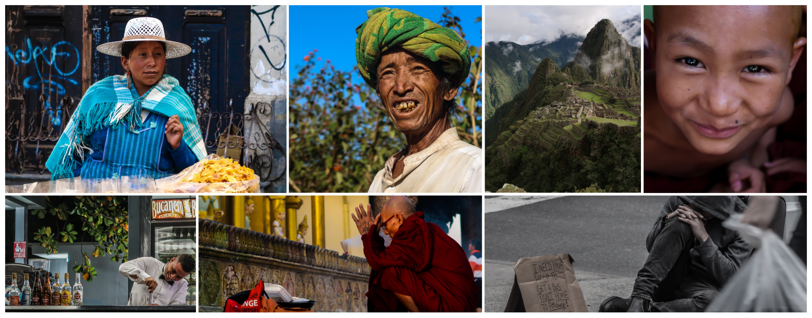

This is the initial commit of what I would like to dedicate some of my time in the upcoming future.

Throughout my career so far, I had the opportunity to work on several different environments, across multiple industries and on all kinds of company stages. I have worked as a **freelance**, on **startups**, **software house**, **financial consulting** and **tech consulting**. In these different environments I managed to work on different positions, **Junior**, **Mid**, **Senior Software Engineer**, **Senior Consultant**, **Lead Engineer** as well as cross functions with **Engineering Manager** positions.

Have always managed to work not only on different company's culture, but also on different cultural settings, as I've worked and lived in **5 different countries** (visited 75). As well as working together with **remote teams** around the globe. 

Therefore, I have decided to share my thoughts, within this blog, on a great range of topics, mostly about the following:

- Software Development
- Engineering & Product
- Leadership
- Venture building
- Culture

Occasionally might write some entries regarding other topics that are also part of my interests, such as **Product Design**, **Photography** and **Traveling**.

The way product engineering challenges are tackled depend not only on your experience, but also the environment you set for the people around you. Having worked on the development of core products, industry-leading digital transformations, from legacy to greenfield projects, from startups to government, from bad to good managers, my goal is to share my experiences and hopefully enable other people to navigate through their challenges.

## Background

I have completed my studies at the University of Porto (Portugal) where I took an MSc. on Software Engineering, followed by an MSc. in Distributed Computing at Cranfield University (UK).

I have worked both on R&D projects for the European Union and a core product for the Manufacturing industry.

Afterward, I have taken some time off to travel around the world while working as a freelance and then moved on to a startup in Berlin (Germany). With the opportunity to move to Toronto (Canada) and lead a team of over 10 people spread both local and near-shore, having in the meantime moved to Montreal to work on a different client, focusing on client and engineering processes to ramp-up development on large scale projects.

Followed by a period of traveling around the world an opportunity appeared to enable me to focus more on venture building alongside several industry-leading companies and help them create and nourish high-performing engineering teams to create new products (and companies) outside of their corporate environment.

## Interests and hobbies

If you read until this point then most likely you can guess some of my hobbies, such as software engineering, traveling, photography, running, and cooking.

Feel free to also check out my [500px](https://500px.com/fsschmitt), reach out to me on [Twitter](https://twitter.com/schmittfelipe) if you would like to debate a bit more about any of the topics I write here.
